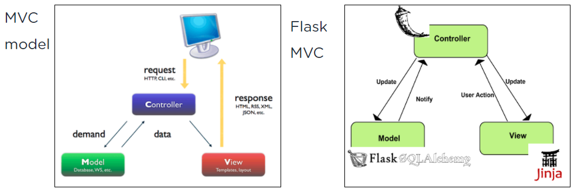

# Flask Introduction
___
## Table Of Contents
* What You Will Learn
* Useful Resources
    * Flask 
    * What Is A Framework? 
    * What Is A Web Application?
* How To Install Flask? 
    * To get started.
* Flask Application Structure
    * How does flask display a page ?
* First touch
     * Steps
* Create a view
* Receiving Arguments In The View
   * Running the server 
   * Changing Your Port  
   * Returning an HTML response
* Feedback
___

## Flask
Flask is a Python web micro-framework designed to be a base for web applications.

## What Is A Framework?
A framework is a set of modules that help programmers develop faster and easier.
These modules contain standard functionalities that handle low-layer tasks such as HTTP requests.

## What Is A Web Application?
A web application is a standard website.
Well-known websites such as, Linkedin, Pinterest, Twilio, and Instagram were all built using the Flask framework.

## How To Install Flask?
<mark style="color: red; background-color: lightgray">pip</mark> is the essential way to install packages for Python!

### To Get Started.
1. Set up a virtual environment
2. From within the environment using the terminal, type the command:
> pip install flask

## Flask Application Structure
Flask is based on the **MVC** model.

**MVC** stands for **Models-Views-Controller**.

In this scenario, a user sends a request to enter a webpage by entering a URL.

* The **Controller** is the constructor; it receives the requests, assembles them, and sends an update to the **Models**.
* The Controller’s update: retrieves the necessary data from the **Models**, organizes it, and notifies the **Controller** of the packaged data.
* Once the Controller gets the Ok from the Models, it builds The View.
* The View uses the Model data and renders the final web page by responding to the user’s request.
The response is presented as a website in the user’s browser.

## How Does Flask Display A Page ?
1. A user sends a request (by entering a URL).
2. The request is routed to a function of the controller.
3. The controller uses the models to retrieve necessary data.
4. The controller builds the view with the data from the models.
5. The controller renders the view and sends it back to the user.

[//]: # (![image]&#40;./image.jpg&#41;)

## First Touch
Let’s start by creating a directory for our project. 

I am going to name this directory **pyblog**.

> mkdir pyblog
> 
> cd pyblog

 <mark style="color: red; background-color: lightgray">**pyblog**</mark> will be the name of our application.

## Steps
In your terminal

1. Check your Python version by typing <mark style="color: red; background-color: lightgray">python --version</mark> or <mark style="color: red; background-color: lightgray">python3 --version</mark> in your terminal.
Make sure to have Python3 installed; Flask supports Python version 3.5 and up. [Upgrade your Python version]().

2. Install **virtualenv** by typing <mark style="color: red; background-color: lightgray">pip install virtualenv</mark> or <mark style="color: red; background-color: lightgray">pip3 install virtualenv</mark>.
“The more Python projects you have, the more likely it is that you need to work with different versions of Python libraries, or even Python itself. Newer versions of libraries for one project can break compatibility in another project. Therefore, use a virtual environment to manage the dependencies for your projects.”

3. Now activate your virtual environment (if you need help review the lesson explaining virtualenvs).

4. Then install flask by using pip install flask or pip3 install flask.

___

Then,

1. Create a new file named app.py inside of your <mark style="color: red; background-color: lightgray">pyblog</mark> folder.
2. To create a Flask application object, the first thing you need to do is Import Flask.
This is an example of a web application object created with the <mark style="color: red; background-color: lightgray">flask.Flask</mark> class.

> import flask
>
>app = flask.Flask(__name__)

The script above creates the application object as an instance of the <mark style="color: red; background-color: lightgray">Flask</mark> class imported directly from the flask package.

The <mark style="color: red; background-color: lightgray">_\_name__</mark> variable passed to the <mark style="color: red; background-color: lightgray">Flask</mark> class is a predefined Python variable. It sets the module’s name and allows it to be called from different places within a project.

Flask uses the <mark style="color: red; background-color: lightgray">_\_name__</mark> location as a central point of reference when it needs to load associated resources such as images or CSS files.

For all practical purposes, passing <mark style="color: red; background-color: lightgray">_\_name__</mark> is almost always going to configure Flask correctly.

etc...